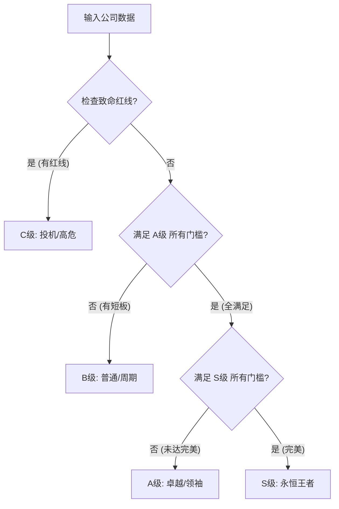

这是为您准备的**公司质量评级状态机 (Quality Tier State Machine)** 的 Markdown 规格说明书。

这份文档将作为您建仓系统中\*\*“质量系数”**计算模块的核心逻辑。它采用了**“漏斗筛选”\*\*机制，而非“加分”机制，确保了评级的严谨性。

-----

# 公司质量评级状态机 (Quality Tier State Machine)

## 1\. 核心设计哲学

  * **有罪推定 (Guilty Until Proven Innocent)**：所有公司初始状态默认为 **B级 (普通/周期)**。
  * **条件满足制 (Logic AND Gates)**：想要晋级，必须满足该层级的所有**硬性指标**。只要有一项短板，立即停止晋级。
  * **一票否决 (Veto Power)**：触犯财务红线，直接降级为 **C级 (垃圾/高危)**。

## 2\. 状态流转图 (State Flow)



-----

## 3\. 评级标准详解 (Tier Criteria)

### 🔴 C 级：投机/高危 (Speculative)

  * **定义**：财务造假嫌疑、濒临破产、纯概念炒作。
  * **质量系数 ($Q_{coeff}$)**：**0.4** (或禁止交易)
  * **判定逻辑 (任意命中一项即降级)**：
    1.  **造假嫌疑**：`经营现金流 < 净利润` (连续 2 年)。
    2.  **偿债危机**：`EBITDA / 利息支出 < 2.0`。
    3.  **极度高估**：`PEG > 3.0` (且非高速成长期)。

### 🟡 B 级：普通/周期 (Average) —— *【默认初始状态】*

  * **定义**：受宏观影响大、内卷严重、利润薄、或处于验证期的公司。
  * **质量系数 ($Q_{coeff}$)**：**0.6** (必须打6折)
  * **典型标的**：吉利汽车 (制造业/低毛利)、大部分周期股、未盈利 SaaS。
  * **判定逻辑**：
      * 未能通过 **C级检查** (非垃圾)。
      * 但在 **A级晋级赛** 中失败。

### 🟢 A 级：卓越/领袖 (Excellent)

  * **定义**：行业龙头，财务健康，有护城河，但可能存在竞争或上市时间较短。
  * **质量系数 ($Q_{coeff}$)**：**0.8** (打8折)
  * **典型标的**：Meta (强竞争)、Figma (上市短)、泡泡玛特 (单一IP风险，若财务极好可勉强入围)。
  * **晋级门槛 (必须全部满足)**：
    1.  ✅ **商业壁垒**：`毛利率 > 30%` (拒绝低端内卷)。
    2.  ✅ **盈利能力**：`ROE (净资产收益率) > 12%` (连续 5 年平均)。
    3.  ✅ **财务刚性**：`净债务 / EBITDA < 3.0` (杠杆可控)。
    4.  ✅ **成长验证**：`营收增长率 > 0` (过去 3 年无负增长)。

### 🌟 S 级：永恒王者 (Supreme)

  * **定义**：上帝执照，跨越周期，垄断地位，现金奶牛。
  * **质量系数 ($Q_{coeff}$)**：**0.95** (打95折，甚至平价买)
  * **典型标的**：茅台、微软、爱马仕。
  * **晋级门槛 (必须已是 A 级，且全部满足以下条件)**：
    1.  ✅ **时间复利**：`上市时间 > 10 年` (久经考验)。
    2.  ✅ **绝对垄断**：`行业地位 == (No.1 OR Duopoly)` (拥有定价权)。
    3.  ✅ **股东厚道**：`分红率 + 回购收益率 > 3%`。
    4.  ✅ **现金奶牛**：`自由现金流 (FCF) Margin > 20%`。

-----

## 4\. 伪代码实现 (Python Logic)

```python
def get_quality_coefficient(stock):
    """
    根据财务指标返回质量折扣系数
    输入 stock 对象包含: 
    gross_margin, avg_roe_5y, ocf_vs_net_income, interest_coverage, 
    listing_years, shareholder_yield, is_leader, fcf_margin
    """
    
    # --- Step 1: 死亡红线检查 (C级判定) ---
    # 如果经营现金流持续低于净利润，或利息覆盖倍数太低
    if (stock.ocf_vs_net_income < 1.0) or (stock.interest_coverage < 2.0):
        return 0.4, "C (High Risk)"
    
    # --- Step 2: 卓越晋级检查 (B -> A) ---
    # 默认是 B 级
    is_A_grade = True
    
    # 门槛 1: 毛利过低说明是苦逼制造业 (如吉利)
    if stock.gross_margin < 0.30: 
        is_A_grade = False
    # 门槛 2: 长期盈利能力差
    elif stock.avg_roe_5y < 0.12: 
        is_A_grade = False
    
    # 如果没通过 A 级测试，直接返回 B
    if not is_A_grade:
        return 0.6, "B (Average/Cyclical)"
        
    # --- Step 3: 王者晋级检查 (A -> S) ---
    # 能到这里，说明已经是 A 级了，检查能否升 S
    is_S_grade = True
    
    # 门槛 1: 上市时间太短 (如泡泡玛特/Figma)
    if stock.listing_years < 10: 
        is_S_grade = False
    # 门槛 2: 对股东不够大方 (铁公鸡)
    elif stock.shareholder_yield < 0.03:
        is_S_grade = False
    # 门槛 3: 赚钱太辛苦 (现金流利润率低)
    elif stock.fcf_margin < 0.20:
        is_S_grade = False
    # 门槛 4: 不是绝对老大
    elif not stock.is_leader:
        is_S_grade = False
        
    if is_S_grade:
        return 0.95, "S (Supreme)"
    else:
        return 0.80, "A (Excellent)"

```

-----

## 5\. 参数配置表 (Config)

| 级别 | 系数 | 适用场景 | 对应最大允许估值误差 |
| :--- | :--- | :--- | :--- |
| **S** | **0.95** | 极高确定性，稍微打折即可 | 5% |
| **A** | **0.80** | 优秀公司，需标准安全边际 | 20% |
| **B** | **0.60** | 普通/周期公司，需深度折扣 | 40% |
| **C** | **0.40** | 垃圾/问题公司，甚至不建议买入 | 60% |

-----

*此文档可直接用于 AI Coding 生成质量评级模块。*